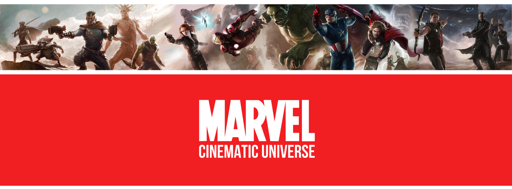

# A Restrospective of Phase One of the MCU

This is a Node-based build that explores the last 15 years of the MCU. Using IMDb API to mine data about each film, and allows the use to add a review for each selection

### Getting Started
This is a basic HTML / CSS / JS buold. if you dont know what these are, start here: [Mozilla Developer Network](https://developer.mozilla.org/en-US/docs/Learn)  

Clone this to the location of your choice, open your favourite editor

### Prerequisites
Just and editor and Git!

## Authors 
1. Jairus Vialu
2. Joshua Alexander

## License
This project is licensed under MIT licence.